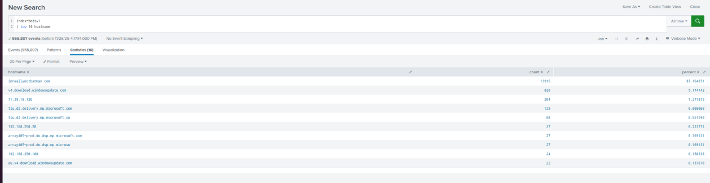
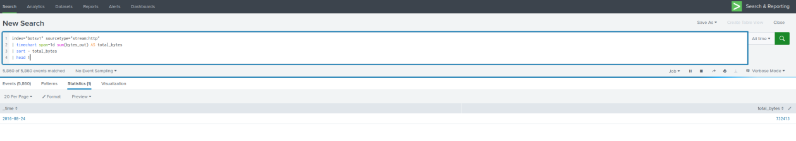
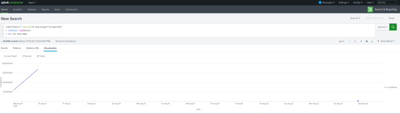
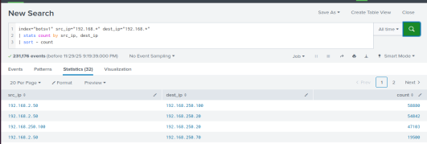
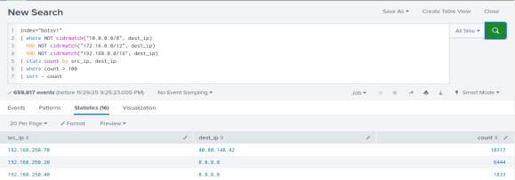
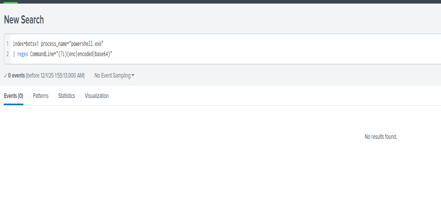

# SIEM Threat Hunting

Threat hunting and log analysis in Splunk, plus a comparison of Splunk and Wazuh as SIEM platforms.

## Overview

Using a Splunk dataset of security events, I built searches to surface suspicious activity and answer concrete hunting questions: which domains were most contacted, which day carried the most HTTP traffic, and whether any hosts showed signs of lateral movement or beaconing out to external addresses.

## What I did

- **Top talkers** – aggregated DNS traffic to find the ten most requested domains and spot unusual destinations
- **Traffic over time** – charted HTTP data volume per time unit to identify the busiest period and traffic spikes
- **Lateral movement** – filtered on internal-to-internal connections to map which machines talked to each other
- **Command & control** – isolated internal hosts reaching out to external IPs to flag possible exfiltration
- **Encoded PowerShell** – searched for `powershell.exe` launched with base64-encoded command lines (a common living-off-the-land technique)

## Splunk vs Wazuh

A written comparison of the two platforms covering development and business model, cost, data ownership, performance, and which organisations each one fits. Short version: Splunk is a commercial enterprise tool with a powerful search language (SPL) but high cost at scale, while Wazuh is open source and free, better suited to smaller organisations and education but more hands-on to run.

## Screenshots

Top 10 requested domains in the DNS traffic, and HTTP data volume over time:

Internal-to-internal connections (lateral movement) and internal hosts reaching external IPs (possible C2):

Hunting for `powershell.exe` launched with base64-encoded command lines:

## Tools & concepts

Splunk · SPL (Search Processing Language) · Wazuh · DNS/HTTP log analysis · lateral movement detection · living-off-the-land detection

## What I took from it

This is where SIEM stopped being a buzzword for me. Writing the searches myself showed how much the quality of a hunt depends on asking the right question and knowing what normal looks like before you can spot what isn't.
